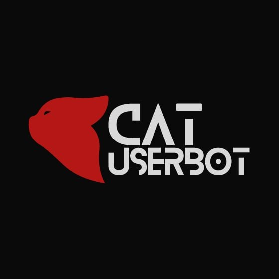

# Introduction

<figure><figcaption>
Vidushano
</figcaption></figure>

Catuserbot has been developed using Python programming language and Telethon MTProto, a client library for the Telegram API that provides a secure and reliable way to interact with the Telegram platform.
