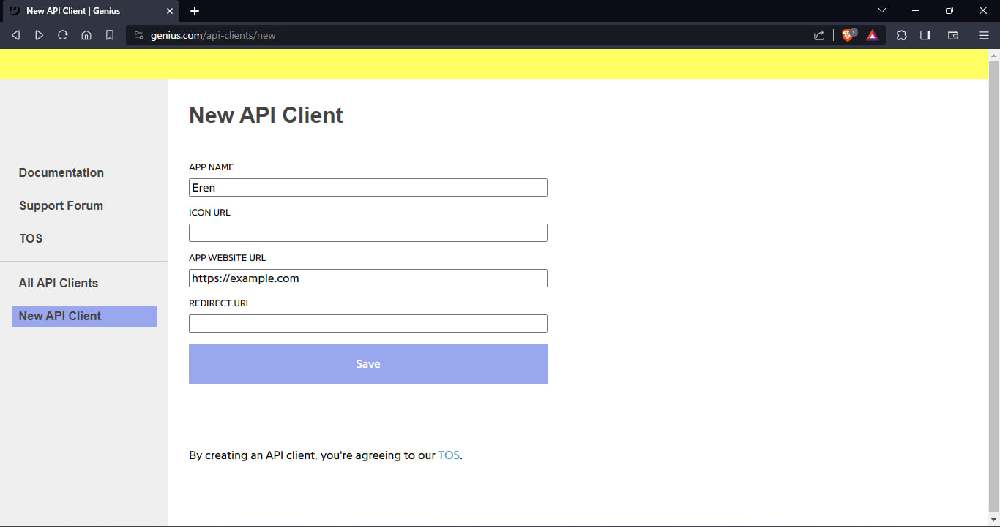
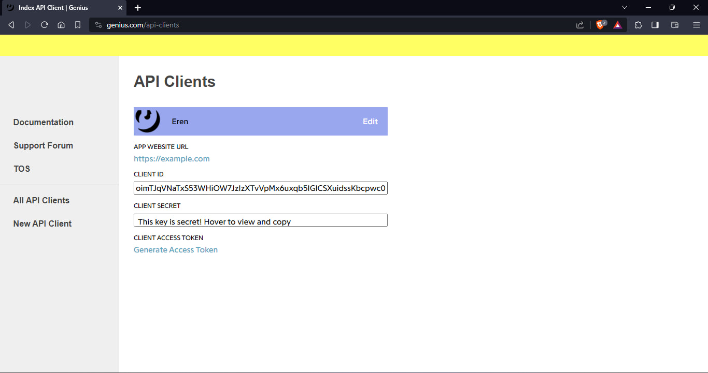

# 📕 Genius API Token

## 〣 Creating an API Client to get Access Token

* Go to [genius.com/api-clients/new](https://genius.com/api-clients/new)
* Click on the "Sign Up" button and Create an Account.
* Enter a name for your App and put `https://example.com` in <mark style="color:green;">APP WEBSITE URL</mark>. You can Leave other two fields empty.

    <figure><figcaption>
Page after clicking 'Create Account' and filling values
</figcaption></figure>

* Click on Save button.

    <figure><figcaption>
Page after clicking 'Save' button
</figcaption></figure>
    
* On This page, click on <mark style="color:blue;">Generate Access Token</mark> and Copy the token. Save the copied token in your bot's configuration file as environment variable with the following name:
  * `GENIUS_API_TOKEN`
